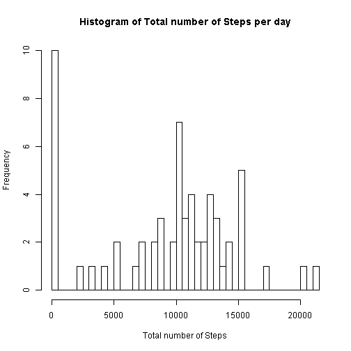
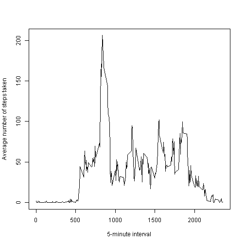
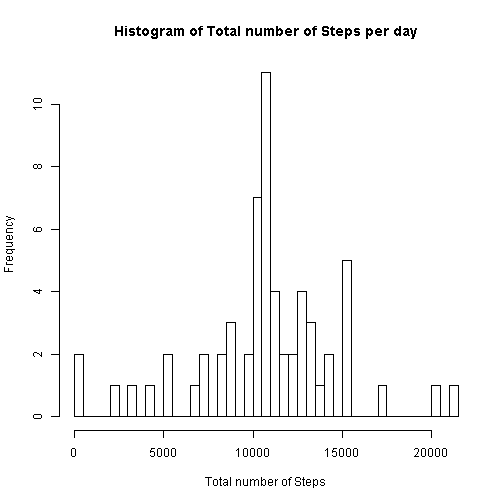
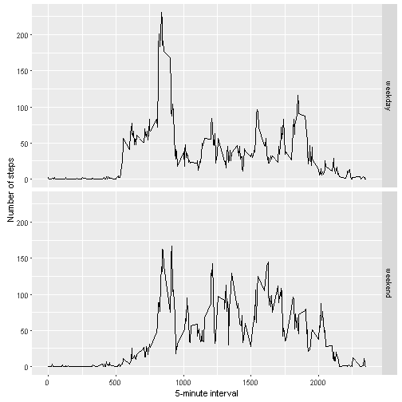

# Reproducible Research: Peer Assessment 1

## Loading and preprocessing the data

```r
unzip(zipfile="repdata-data-activity.zip")
data <- read.csv("activity.csv")
data1 <- subset(data, !is.na(data$steps))
```

## What is mean total number of steps taken per day?

```r
total_steps <- with(data, tapply(steps, date, FUN=sum, na.rm=TRUE) )
hist(total_steps, breaks = 50, xlab = "Total number of Steps", main = "Histogram of Total number of Steps per day")
```



```r
print ("Mean value of Total number of steps per day:")
```

```
## [1] "Mean value of Total number of steps per day:"
```

```r
mean(total_steps)
```

```
## [1] 9354.23
```

```r
print ("Median value of Total number of steps per day:")
```

```
## [1] "Median value of Total number of steps per day:"
```

```r
median(total_steps)
```

```
## [1] 10395
```

## What is the average daily activity pattern?

```r
averages <- aggregate(x=list(steps=data$steps), by=list(interval=data$interval),
                      FUN=mean, na.rm=TRUE)
plot(averages, type = "l", xlab = "5-minute interval", ylab = "Average number of steps taken")
```



```r
print ("5-minute interval, on average across all the days in the dataset, contains the maximum number of step")
```

```
## [1] "5-minute interval, on average across all the days in the dataset, contains the maximum number of step"
```

```r
averages[which.max(averages$steps),]
```

```
##     interval    steps
## 104      835 206.1698
```

## Imputing missing values

There are many days/intervals where there are missing values (coded as `NA`). The presence of missing days may introduce bias into some calculations or summaries of the data.


```r
print("How many steps has missing value")
```

```
## [1] "How many steps has missing value"
```

```r
sum(is.na(data$steps))
```

```
## [1] 2304
```

All of the missing values are filled in with mean value for that 5-minute
interval.


```r
# Replace each missing value with the mean value of its 5-minute interval
fill_func <- function(steps, interval) {
    filled <- NA
    if (!is.na(steps))
        filled <- c(steps)
    else
        filled <- (averages[averages$interval==interval, "steps"])
    return(filled)
}
processed_data <- data
processed_data$steps <- with(processed_data, mapply(fill_func, steps, interval))
```
Now, using the filled data set, let's make a histogram of the total number of steps taken each day and calculate the mean and median total number of steps.


```r
total_steps <- with(processed_data, tapply(steps, date, FUN=sum) )
hist(total_steps, breaks = 50, xlab = "Total number of Steps", main = "Histogram of Total number of Steps per day")
```



```r
print ("Mean value of Total number of steps per day:")
```

```
## [1] "Mean value of Total number of steps per day:"
```

```r
mean(total_steps)
```

```
## [1] 10766.19
```

```r
print ("Median value of Total number of steps per day:")
```

```
## [1] "Median value of Total number of steps per day:"
```

```r
median(total_steps)
```

```
## [1] 10766.19
```
Mean and median values becomes higher compared to previous calculated value. 
In previous calculation, some days all values were `NA`, which transaltes total 
steps in that period to be 0, and brings down mean and median value. 
However, with current calculation, instead of 0, it is getting replaced by 
average value, which results in higher mean and median value.


## Are there differences in activity patterns between weekdays and weekends?
First, let's find the day of the week for each measurement in the dataset. In
this part, we use the dataset with the filled-in values.


```r
weekday.or.weekend <- function(date) {
    day <- weekdays(date)
    if (day %in% c("Monday", "Tuesday", "Wednesday", "Thursday", "Friday"))
        return("weekday")
    else if (day %in% c("Saturday", "Sunday"))
        return("weekend")
    else
        stop("invalid date")
}
processed_data$date <- as.Date(processed_data$date)
processed_data$day <- with(processed_data, sapply(date, FUN=weekday.or.weekend) )
```

Now, let's make a panel plot containing plots of average number of steps taken
on weekdays and weekends.

```r
library(ggplot2)
averages <- aggregate(steps ~ interval + day, data=processed_data, mean)
ggplot(averages, aes(interval, steps)) + geom_line() + facet_grid(day ~ .) +
    xlab("5-minute interval") + ylab("Number of steps")
```


